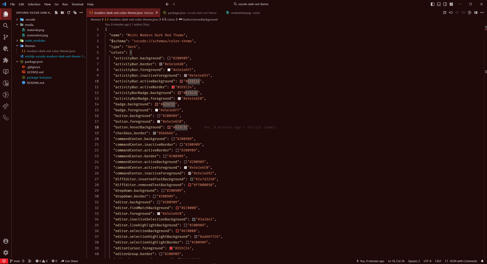

# Modern Dark Purple Theme



A Modern Dark Purple Theme Theme extension for VS Code. I've been using and perfecting this theme for more than 5 years and I hope you enjoy it.

## Install

You can install the extension by one of the following ways:

- Search for `Modern Dark Purple Theme` in extension panel and install it
- Download from [Marketplace](https://marketplace.visualstudio.com/items?itemName=michijs.vscode-modern-dark-purple-theme)
- Download from [GitHub Release](https://github.com/michijs/vscode-modern-dark-purple-theme/releases) page

## Preferred settings 
On user settings (JSON):
```json
{
  "explorer.confirmDragAndDrop": false,
  "workbench.colorTheme": "Michi Modern Dark Purple Theme",
  "editor.bracketPairColorization.enabled": false,
  "git.postCommitCommand": "sync",
  "git.confirmSync": false,
  "diffEditor.ignoreTrimWhitespace": false,
  "workbench.productIconTheme": "material-product-icons",
  "workbench.iconTheme": "material-icon-theme",
  "editor.minimap.enabled": false,
  "editor.lineHeight": 24,
  "editor.fontLigatures": true,
  "explorer.decorations.badges": true,
  "editor.fontFamily": "'Fira Code', Menlo, Monaco, 'Courier New', monospace",
  "sync.gist": "09894e5705e443cec6b65d2e6c7dac96",
  "workbench.activityBar.location": "top",
  "window.menuBarVisibility": "compact",
  "terminal.integrated.fontFamily": "'Fira Code', Menlo, Monaco, 'Courier New', monospace",
  "terminal.integrated.fontSize": 13,
  "explorer.openEditors.visible": 1,
  "explorer.autoReveal": false,
  "workbench.tree.indent": 10,
  "breadcrumbs.enabled": false,
  "editor.glyphMargin": false,
  "editor.smoothScrolling": true,
  "explorer.compactFolders": false,
  "window.autoDetectHighContrast": false,
  "workbench.editor.tabActionCloseVisibility": false,
  "editor.hideCursorInOverviewRuler": true,
  "editor.cursorBlinking": "phase",
  "editor.cursorSmoothCaretAnimation": "on",
  "workbench.layoutControl.enabled": false,
  "workbench.editor.editorActionsLocation": "titleBar",
}
```

- Install [Fira code](https://github.com/tonsky/FiraCode/wiki/VS-Code-Instructions) font.
- Install [Material Product Icons](https://marketplace.visualstudio.com/items?itemName=PKief.material-product-icons)
- Install [Material Icon Theme](https://marketplace.visualstudio.com/items?itemName=PKief.material-icon-theme)
