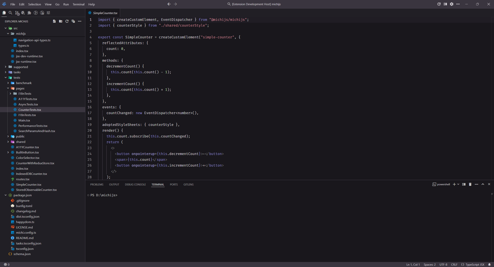

# Modern Dark Red Theme



A Modern Dark Red Theme Theme extension for VS Code. I've been using and perfecting this theme for more than 5 years and I hope you enjoy it.

## Install

You can install the extension by one of the following ways:

- Search for `Modern Dark Red Theme` in extension panel and install it
- Download from [Marketplace](https://marketplace.visualstudio.com/items?itemName=michijs.vscode-modern-dark-red-theme)
- Download from [GitHub Release](https://github.com/michijs/vscode-modern-dark-red-theme/releases) page

## Preferred settings 
On user settings (JSON):
```json
  "diffEditor.ignoreTrimWhitespace": false,
  "workbench.productIconTheme": "material-product-icons",
  "workbench.iconTheme": "material-icon-theme",
  "editor.minimap.enabled": false,
  "editor.lineHeight": 24,
  "editor.fontLigatures": true,
  "explorer.decorations.badges": true,
  "editor.fontFamily": "'Fira Code'",
```

- Install [Fira code](https://github.com/tonsky/FiraCode/wiki/VS-Code-Instructions) font.
- Install [Material Product Icons](https://marketplace.visualstudio.com/items?itemName=PKief.material-product-icons)
- Install [Material Icon Theme](https://marketplace.visualstudio.com/items?itemName=PKief.material-icon-theme)
